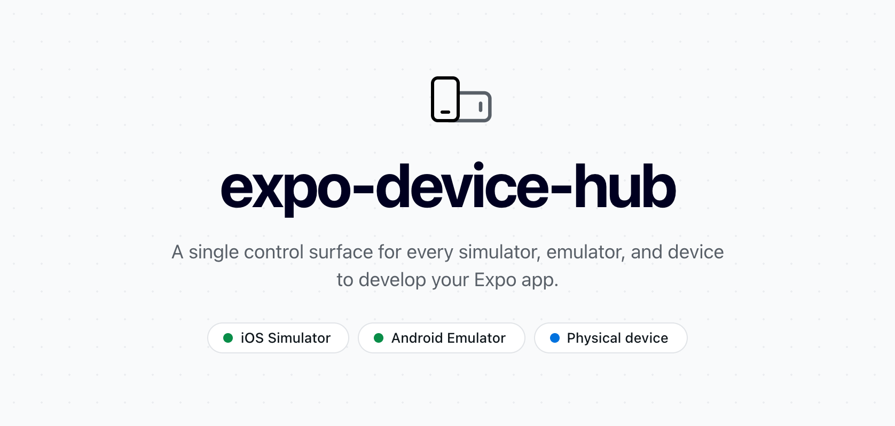

<p align="center">
  <a href="https://github.com/expo/expo-device-hub">
    <picture>
      <source media="(prefers-color-scheme: dark)" srcset="assets/expo-device-hub-banner-dark-2x.png">
      
    </picture>
  </a>
</p>

# expo-device-hub

**Expo Device Hub** is an [Expo DevTools plugin](https://docs.expo.dev/debugging/devtools-plugins/)
that lets you preview and control your iOS simulators and Android emulators right from
the browser — without leaving your development workflow. When you run `expo start`, the
Hub adds a device dashboard where you can watch a live stream of any device, interact
with it, and manage which devices are running from one place.

## Features

- Live stream of iOS simulators and Android emulators in your browser.
- Interact directly — tap, swipe, scroll, and type into the device.
- Boot, shut down, and add devices without opening Xcode or Android Studio.
- Follows your system light/dark theme, and can flip the device's appearance too.

> iOS simulators require macOS with Xcode. Android emulators require the Android SDK
> (`emulator`, `adb`).

## Use in an Expo app

> Using the Hub inside an Expo app requires **Expo SDK 57** or newer.

Install the plugin:

```sh
npx expo install expo-device-hub
```

Then start your project as usual:

```sh
npx expo start
```

Expo Device Hub registers itself as a DevTools plugin, so a link to it appears in your
terminal when the dev server starts:

```
› Expo Device Hub: http://localhost:8081/_expo/plugins/expo-device-hub
```

## Use standalone

The Hub also runs outside of `expo start` as a standalone server — useful when you want
the device dashboard without a running Expo project:

```sh
npx expo-device-hub
```

## Repository structure

This is a [Bun](https://bun.sh) workspace orchestrated with [Turborepo](https://turbo.build).

| Package | What it is |
| --- | --- |
| [`packages/expo-device-hub`](packages/expo-device-hub) | The main DevTools plugin. |
| [`packages/@expo/hub-client`](packages/@expo/hub-client) | Device-client hooks and types that own the connection to serve-sim / serve-emu and paint the live stream. See [_hub-client_](#hub-client) below. |
| [`packages/@expo/hub-components`](packages/@expo/hub-components) | Dependency-free UI kit (`Sidebar`, `StreamPanel`, `Button`, …) built on `@expo/styleguide` design tokens, so Hub matches the Expo dashboard website. |
| [`packages/@expo/hub-apple-utils`](packages/@expo/hub-apple-utils) | Lists, creates, and boots Apple devices via `devicectl` / `simctl` (macOS only). |
| [`packages/@expo/hub-android-utils`](packages/@expo/hub-android-utils) | Lists, creates, and boots Android emulators via `avdmanager` / `sdkmanager` / `emulator`. |
| [`packages/expo-serve-emu`](packages/expo-serve-emu) | Thin wrapper of `serve-emu`. To be replaced by [`@expo/serve-emu`](http://www.github.com/expo/serve-emu). |
| [`packages/serve-sim`](packages/serve-sim) | Vendored fork of `serve-sim`. To be replaced by [`@expo/serve-sim`](http://www.github.com/expo/serve-sim). |
| [`packages/serve-emu`](packages/serve-emu) | Vendored fork of `serve-emu`. To be replaced by [`@expo/serve-emu`](http://www.github.com/expo/serve-emu). |
| [`example`](example) | A minimal Expo app with the plugin installed. |

## Getting started

Install dependencies and build every package once from the repo root:

```sh
bun install
bun run build   # turbo build across all packages
```

### Run the example

The [`example`](example) app is a host Expo project that has `expo-device-hub`
installed as a DevTools plugin. Use it to see the Hub exactly as an end user would.

```sh
cd example
bun start       # or: bun run ios / bun run android / bun run web
```

### Develop

To iterate on the dashboard UI with Metro fast refresh, run `expo-device-hub` as a
**standalone Expo web app**:

```sh
cd packages/expo-device-hub
bun start          # expo start --web, on port 8081
```

This serves the [`Dashboard`](packages/expo-device-hub/src/Dashboard.tsx) component directly, so edits to the UI hot-reload without going through a host app.
A local "inception" DevTools module ([`modules/expo-device-hub`](packages/expo-device-hub/modules/expo-device-hub))
registers the plugin against itself, so the standalone app still gets the real
`/api/devices` backend while you develop.

> The device **server** is bundled (see [`scripts/build-plugin-server.ts`](packages/expo-device-hub/scripts/build-plugin-server.ts)),
> so hot reload covers the UI. After changing anything under
> [`src/server`](packages/expo-device-hub/src/server), rebuild it with
> `bun run build:server`.

## hub-client

[`@expo/hub-client`](packages/@expo/hub-client) is the **device-client layer**. The
two backends speak very different wire protocols — serve-sim streams MJPEG/H.264 and
takes binary touch packets, while serve-emu streams H.264 (WebCodecs) and takes JSON
gestures — so this package hides that behind one shared contract:

- a hook (`useIosDeviceClient` / `useAndroidDeviceClient` and general
  `useActiveDeviceClient`) that owns the WebSocket connection and exposes the live
  connection state plus input controls, and
- a `DeviceScreen` component that paints whichever stream is active and forwards
  pointer/gesture/keyboard input.

It lives in its own package (rather than inside the plugin) so the **Expo dashboard
website** can consume the exact same code to mirror devices in the browser.
