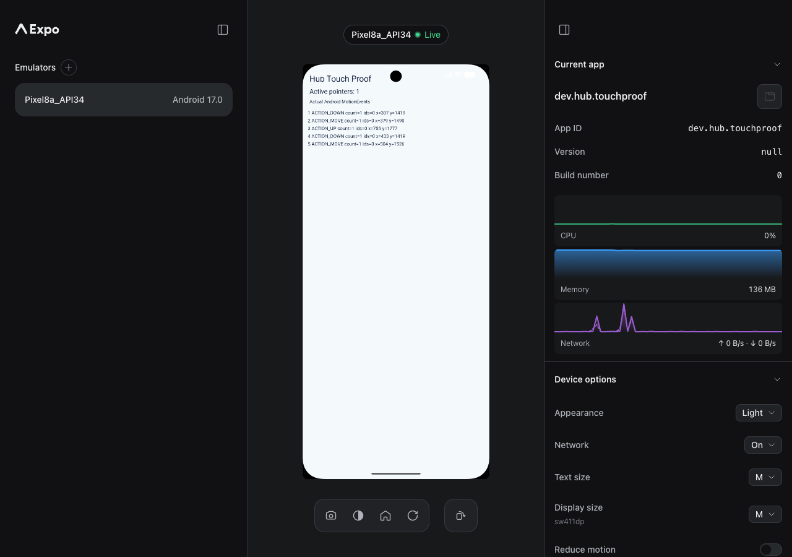
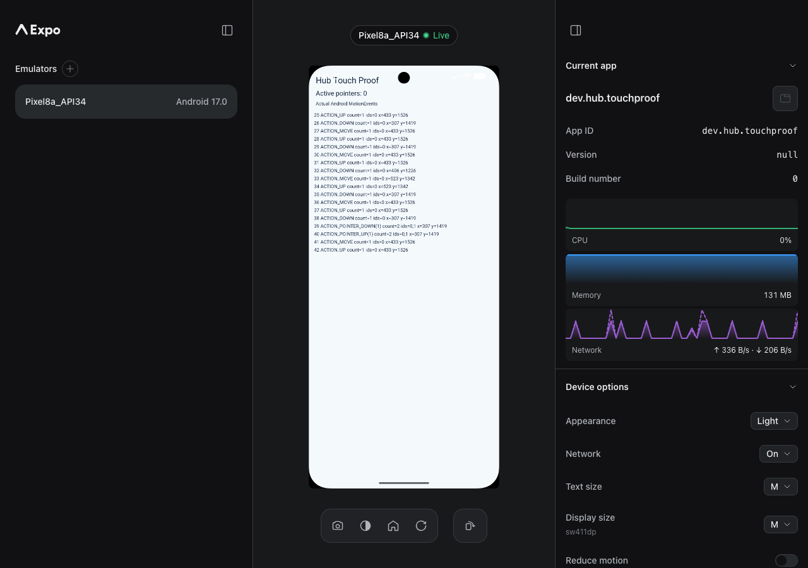

# Android touch disconnect verification

Verified by Codex on an Android Emulator; final human review pending.

The primary regression is closing a preview tab while dragging. A lone viewer
can trigger it. Per-connection isolation is needed so that releasing the
closed tab does not release a different viewer's active finger.

## Before and after

Baseline: `83d2ca5`. Final runtime verification: `208c8f0`.

| Before: tab closed, touch remains pressed | After: tab closed, touch released |
| --- | --- |
|  |  |

Both pictures show the production Expo Device Hub UI streaming an emulator.
The temporary `dev.hub.touchproof` app displays actual Android MotionEvents and
the number of active pointers; ADB logcat independently captured those events.

On the baseline, the held viewer tab closed at approximately 10:13:27; the
observer screenshot at 10:13:50 still showed one active pointer and no UP.
On the final build, the held viewer's disconnect produced an UP and the
observer showed zero active pointers while the Hub remained Live.

## Reproduction

1. Build and run the local Hub, boot an emulator, and select it in the browser.
2. Open a second viewer of the same device to observe the stream.
3. Press and drag in the first viewer. Close its tab without releasing the mouse.
4. Observe whether the Android gesture ends. The second viewer should remain live.

The observer is useful for evidence, but is not required to trigger the bug.
For isolation coverage, press in both viewers, release one, then continue
moving in the other. It must remain a valid drag until its own release.

## Final runtime trace

The final run also replayed a recording that ended while the original viewer
was still pressed. Replay created its own pointer and released it on completion.
The original viewer then continued moving and was released by closing its tab:

```text
16:42:54.797 38 ACTION_DOWN count=1 ids=0
16:42:54.987 39 ACTION_POINTER_DOWN(1) count=2 ids=0,1
16:42:54.990 40 ACTION_POINTER_UP(1) count=2 ids=0,1
16:43:17.555 41 ACTION_MOVE count=1 ids=0
16:43:17.906 42 ACTION_UP count=1 ids=0
```

The saved session finished with `source: ws:disconnect`, `action: up`.
Replay status was `completed`; Hub health was `streaming`, with no last error.

## Environment and coverage

- Android Emulator 36.6.11.0, AVD named Pixel8a_API34, running Android 17/API 37.
- scrcpy server v4.0, Chrome 150, Bun 1.3.14.
- Final build/checks and final Hub runtime explicitly pinned Node 24.14.0.
- Default Hub transport: gRPC RGB888 capture, software H.264, scrcpy input.
- Also verified tab-close release using gRPC input, scrcpy capture, WebRTC's
  input-only socket, the Expo example app's DevTools mount, and standalone
  serve-emu. Checked another viewer's continuing drag and Alt-drag pinch.
- The broader transport matrix ran before the recording-lifecycle follow-up
  in `208c8f0`. The final commit was rebuilt and its default Hub path plus
  live/replay ownership were verified again on the emulator.
- Alt-drag pinch was dispatched through DeviceScreen using PointerEvents with
  altKey because the browser tool's low-level mouse commands did not preserve
  the modifier. Android reported two pointers and their releases.
- Earlier temporary-checkout runs used Homebrew Node 25.9.0 due to shell PATH.
  Final checks and the final runtime trace above use pinned Node 24.14.0.
- No physical-device, iOS runtime, or EAS recording workflow validation is claimed.

## Automated results

- Failing regressions first: `da82f51`, 5 existing tests passed / 13 new tests failed.
- Final related input/recorder suites: 87 passed.
- Root lint, CI-filtered build, typecheck, README sync, packed-package smoke,
  and critical coverage-module presence checks passed.
- Full serve-emu suite: 1,150 passed / 1 failed. The failure is the Vite proxy
  WebSocket timeout. It also reproduces in isolation on unmodified `83d2ca5`
  under Node 24.14.0 (12 passed / 1 failed). No test was skipped or changed to
  hide this failure. The aggregate check and root tests are not green locally.

Test browsers and servers were stopped, the temporary Android app uninstalled,
and the emulator shut down after verification.


## Review follow-up: await replay touch releases

[Devin's review](https://github.com/expo/expo-device-hub/pull/184#discussion_r4133173494)
identified that replay could report completion before its queued UP finished.
Codex reproduced the delay and failure cases with the production recorder,
device-state and input-queue classes, using a controlled input writer.

The follow-up returns a shared cleanup Promise, waits for every release through
all finalization layers, and records release failures. Abort and finalization
reuse the same result; cancellation during cleanup stays cancelled and retains
any cleanup error. WebSocket disconnect cleanup remains fire-and-forget.

Validation by Codex:

- Regression-first commit `cad3fab`: six new tests failed before the fix.
- After the fix: 93 related input/recorder tests passed. Cases include blocked
  UP, failed UP, cancellation before/during cleanup, and a failed release while
  another release is still pending.
- Full serve-emu suite: 1,156 passed, with the same pre-existing Vite WebSocket
  proxy timeout remaining as its one failure.
- Package typecheck, root typecheck, serve-emu build, Hub vendoring/server build,
  documentation synchronization and packed-package smoke passed.
- Rebuilt Hub, Node 24.14.0 / Bun 1.3.14, the same Android 17 emulator:
  replaying a held touch released only the replay pointer; the original viewer
  continued moving and released when its tab closed. Native events were
  DOWN → POINTER_DOWN → POINTER_UP → MOVE → UP, ending with zero pointers.
  Injected transport delay/failure was tested through the controlled writer,
  not by modifying the emulator transport.

Human review of this follow-up remains pending.
