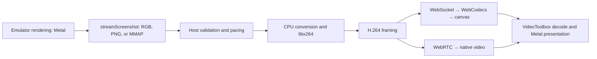

# gRPC `streamScreenshot`: implementation and pipeline review

The RGB option carries uncompressed RGB888 pixels in the Android Emulator's
server-pushed `streamScreenshot` messages. It reuses the existing host encoder,
stream transports, device controls, and browser players. Hub retains MMAP as its
default; RGB is an explicit choice in the CLI and **Stream options**.



## Reference PR #3

[expo-device-hub#3](https://github.com/expo/expo-device-hub/pull/3) demonstrated
inline RGB capture followed by host ffmpeg encoding, reporting approximately
30 FPS without host GPU acceleration compared with approximately 10 FPS using
scrcpy. Those are the reference author's observations, not measurements of this
implementation. The review covered commits `973d8fc` and `3c91126`.

### Standards

The review found no hard violations of the historical `CLAUDE.md` rules. It
identified robustness concerns in the custom gRPC client: unbounded message
lengths, uncaught protobuf callbacks, and startup errors hidden until the
first-frame timeout. The fixed 40 ms AUD flush also adds duplicate frames to
encoded FPS. Duplicated gesture/input logic was a possible code smell, not a
documented-standard violation. Current upstream already supplies hardened
framing, startup handling, shared input modules, and adaptive boundary timing;
the RGB option extends those modules.

### Spec

The reference implements the requested host capture approach, but its reported
FPS cannot by itself establish fresh-frame throughput: the session also encodes
duplicate frames for idle output and to flush access-unit boundaries. Its idle
repeats can keep the output watchdog satisfied while the source stops updating;
the current client has a bounded inactivity probe and separate capture counters.
The reference only changes the vendored serve-emu UI and does not supply the
current request's separate Hub controls or comparison against MMAP.

This implementation adds RGB to the current image-mode abstraction instead of
copying the old session. It preserves the existing startup readiness, geometry,
cancellation, strict mode switching, and diagnostics. See
[capture selection](../packages/serve-emu/packages/serve-emu/src/grpc-session.ts),
[image-mode contracts](../packages/serve-emu/packages/serve-emu/src/shared/api-contracts.ts),
and [Hub controls](../packages/@expo/hub-components/src/dashboard/StreamOptionsSection.tsx).

## Capture and encoding

All three modes subscribe to one `streamScreenshot` RPC for normal live capture.

| Mode | Pixel delivery | Work before H.264 encoding |
| --- | --- | --- |
| PNG | Compressed image in each gRPC message | Emulator PNG compression, then host PNG decoding |
| RGB | Raw RGB888 pixels in each gRPC message | Bounded HTTP/2 message assembly, pacing, and protobuf decoding |
| MMAP | gRPC metadata notifications plus a reused shared memory region | Notification pacing and a stable host read/copy of RGB pixels |

RGB keeps draining HTTP/2 and retains the newest complete pending message until
the next decoding slot. This prevents old large pixel messages from accumulating
behind paused reads. PNG retains its producer-backpressure policy. MMAP decodes
its lightweight notifications before scheduling reads of the shared region.
Invalid or incomplete RGB payloads never enter ffmpeg's raw-video input. See
[gRPC framing and pacing](../packages/serve-emu/packages/serve-emu/src/emulator-grpc.ts)
and [MMAP reads](../packages/serve-emu/packages/serve-emu/src/grpc-mmap.ts).

Unary `getScreenshot` calls remain for native-size startup probing, geometry
refreshes after display-size changes, and bounded idle health checks. The startup
and geometry probes use PNG; the idle probe uses the selected stream format.
These calls do not form a screenshot polling loop for normal animation. Probe
frames retain their source identity so they do not train the active stream's
cadence estimator.

The shared [H.264 encoder](../packages/serve-emu/packages/serve-emu/src/h264-encoder.ts)
runs ffmpeg with CPU `libx264`, `ultrafast`, `zerolatency`, baseline H.264, and
YUV420P output. RGB and MMAP both feed `rgb24`. Geometry handling crops to even
dimensions and applies the required orientation. This change does not select a
hardware H.264 encoder.

The Annex-B parser recognizes complete frames at Access Unit Delimiter (AUD)
boundaries. An idle source can leave the last frame waiting for the next AUD,
so the session submits a duplicate after the observed source cadence goes idle.
Separate periodic repeats keep static screens available. Fresh capture and repeat
counters must therefore be considered separately when reporting FPS.

## Delivery and browser presentation

The encoded Annex-B H.264 packet format is unchanged. WebSocket viewers receive
H.264 with optional frame metadata; the existing
[WebRTC publisher](../packages/serve-emu/packages/serve-emu/src/webrtc-publisher.ts)
packetizes the same encoded frames into RTP. Selecting RGB changes emulator-to-host
pixel delivery, not the codec sent to the browser. Input stays independently
selectable between control-only scrcpy and emulator gRPC.

Hub's [Android client](../packages/@expo/hub-client/src/useAndroidDevice.ts)
decodes WebSocket H.264 through WebCodecs and draws it to a canvas, with an MSE
fallback when WebCodecs is unavailable. Its WebRTC path uses a native `<video>`
element. The standalone serve-emu WebSocket UI uses a
[worker and OffscreenCanvas](../packages/serve-emu/packages/serve-emu/src/ui/lib/stream-worker.ts)
and paints the latest decoded frame at an animation-frame boundary.

In the tested Chrome session, CDP Media diagnostics identified
`VideoToolboxVideoDecoder` with the platform-decoder flag enabled for WebCodecs.
A WebRTC trace also showed `MojoVideoDecoderService::OnDecoderOutput` emitting
NV12 shared images labeled `VideoToolboxVideoDecoder` with `MacosVideoToolbox`
usage, confirming the accelerated decoder for the native video path. Chrome GPU
diagnostics showed Metal-backed acceleration for canvas and compositing. This
confirms accelerated browser decoding/rendering for that session even though
Hub does not set a WebCodecs `hardwareAcceleration` preference. An explicit
preference is only a browser hint, so changing it would not establish a hardware
path by itself. See the [WebCodecs hardware acceleration definition](https://w3c.github.io/webcodecs/#hardware-acceleration).

Emulator GPU acceleration is a separate stage. Launching the guest emulator with
`-gpu host` lets it use host graphics acceleration; a software-rendered emulator
can limit the production rate before capture begins. Keep the guest renderer,
host CPU encoder, and browser decoder/compositor distinct in comparisons. Record
the effective emulator renderer as well as its launch flag, and report the host
GPU run separately from the software baseline used to evaluate the reference
PR's motivation.

## Reproduction and measurement

After building this checkout and with the selected Android Emulator running,
launch the standalone Hub CLI:

```sh
node packages/expo-device-hub/dist/server/cli.mjs --port 3400 \
  --platform android --transport webrtc --video-fps 60 \
  --max-dimension 1280 --grpc-image-mode rgb
```

Use the CLI from this checkout when comparing the implementation. Repeat with
`--grpc-image-mode mmap`, or change **Stream options → gRPC frames** at runtime.
Keep emulator, workload, image dimensions, bitrate, input source, browser, and
visibility constant. Exclude hidden and display-asleep windows: during testing,
macOS display sleep stopped animation-frame and video-frame callbacks even while
`document.visibilityState` remained `visible`. Verify a live 60 Hz browser
presentation cadence while sampling. The requested FPS is a limit, not a measured
result.

Collect matching active-animation windows after startup using the device's
`/vendor/serve-emu/health` and
`/vendor/serve-emu/webrtc/stats?device=emulator-5554&sessionId=<active-session>`
endpoints. The active session ID is in `health.webrtc.detail`; the metrics
endpoint requires it. Pair source production/receive cadence,
fresh encoder writes, repeats, backpressure, bytes, and timing quantiles with
browser decoded/dropped frame counters and `requestVideoFrameCallback`
`presentedFrames` deltas. Hub's
[statistics parser](../packages/@expo/hub-client/src/stream-stats.ts) and
[statistics UI](../packages/@expo/hub-components/src/dashboard/StreamStatistics.tsx)
preserve RGB as the capture mode. Existing standalone
[statistics downloads](../packages/serve-emu/packages/serve-emu/src/ui/lib/stream-stats-download.ts)
combine viewer state with server endpoint snapshots.

The pipeline review identifies three limits on interpreting those measurements:

- Hub WebSocket FPS counts canvas draw calls. Multiple draws before a display
  refresh can overwrite one another, so that count does not prove composited
  presentation FPS. WebRTC `presentedFrames` tracks frames submitted for composition;
  callback count alone can miss frames under main-thread load.
- Host H.264 encoding remains CPU work even with accelerated emulator rendering
  and browser decoding. Compare encoder throughput and CPU cost before attributing
  a difference solely to RGB versus MMAP capture.
- Endpoint capture timing ends at host receipt or usable pixels. It excludes
  encoding, transport, browser decode, and display presentation, and must not be
  labeled end-to-end interaction latency.

## Performance results

Tested on 7 September 2026: Apple M2 / 8 GB RAM, Android Emulator 37.2.7.0,
Pixel_10 / Android 17, headless emulator with `-gpu host` (Metal), and headed
Chrome for Testing 152.0.7977.64. Each valid sample runs approximately 30.7 seconds
after warmup, with a visible tab, an awake 60 Hz display, 570×1280 encoded output,
60 FPS cap, 8 Mbps target, and scrcpy input. The shared workload is
[compositor-driven moving bars](benchmarks/grpc-motion.html).

| Capture / browser transport | Received / decoded FPS | Presented FPS | Encoded FPS | gRPC MB/s | MMAP reads MB/s | Produce→receive p50 / p95 |
| --- | ---: | ---: | ---: | ---: | ---: | ---: |
| RGB / WebRTC | 59.91 / 59.91 | 59.22 | 59.91 | 130.70 | 0 | 8.8 / 13.7 ms |
| MMAP / WebRTC | 59.98 / 59.95 | 59.62 | 59.98 | 0.00786 | 262.58 | 1.7 / 2.4 ms |
| RGB / WebSocket | — / 60.05 | 54.53* | 60.05 | 130.66 | 0 | 8.7 / 13.5 ms |

WebRTC presentation uses `requestVideoFrameCallback` **presented-frame deltas**,
not callback counts. Both WebRTC windows had **zero decoded-frame drops and zero
publisher drops**. Mean browser decode time was about 1 ms per frame. The RGB
sample had only 46.44 video callbacks/s despite 59.22 presented frames/s, showing
why counting callbacks alone understates rendering throughput.

*WebSocket presentation is a **vsync-based estimate**: count animation-frame
intervals in which the device canvas changed. Its 60.05 decode/draw calls per
second did not result in 60 distinct visible canvas updates. This is not the
native video's compositor-presented counter. The path therefore does not prove
sustained visible 60 FPS just because its existing FPS readout says 60.

RGB and MMAP both sustain approximately 60 FPS through the WebRTC pipeline in
this workload. MMAP has lower capture latency and avoids moving raw pixels over
HTTP/2; its read counter includes the two verification reads used to obtain a
stable shared-memory snapshot. At this resolution, RGB carries 2,188,800 bytes
per frame before H.264 encoding. These are local emulator-to-host traffic costs,
not browser network bitrate. A single paired sample does not establish a
statistically significant presentation-rate advantage for either capture mode.

A separate exploratory software-renderer baseline, before the RGB pacing fix,
used `-gpu swiftshader` and a continuously redrawn canvas workload: RGB produced
19.22 decoded FPS / 18.92 canvas-update FPS; MMAP produced 17.62 / 17.52. It is not
a controlled before/after comparison with the Metal/compositor-bar measurements,
since renderer, workload, and RGB pacing changed. The heavier canvas workload
also limited the Metal run's source to roughly 40–45 FPS before switching to the
compositor-driven workload. A configured 60 FPS cap cannot make a slower source
produce 60 fresh frames.

The [measurement data](benchmarks/grpc-stream-screenshot.json) preserves each
valid window's endpoint counters, browser counters, sampling duration, and one
WebRTC trace event proving VideoToolbox output. Hidden/display-asleep windows and
windows spanning receiver replacement were discarded. Values in the table come
from counter deltas over the full window; timing quantiles are the final rolling
capture snapshot, not a whole-window latency histogram.

### Runtime fixes and validation

- RGB's message pacer continuously drains fragmented HTTP/2 input, coalesces to
  the newest complete message, and keeps a fixed frame schedule after late timers.
  Deterministic fragmentation and timer-delay regressions failed before this fix.
- Switching capture modes originally left Hub's old WebRTC peer alive until its
  watchdog recovered, causing an approximately 18-second freeze. The Hub now
  uses the confirmed replacement generation to renegotiate before waiting for
  its first frame. Initial metadata and failed/no-op switches retain the peer.
- Browser testing uses agent-browser against the built standalone Hub CLI and
  serve-emu UI. Timed browser counters also use Chrome DevTools Protocol; this
  avoids a stalled long-running agent-browser evaluation and records receiver
  identities so a replacement cannot produce invalid negative counter deltas.

Rebuilt Hub runtime checks measured **2.45 seconds RGB→MMAP** and **2.52 seconds
MMAP→RGB**, from the PUT request starting to the new peer being connected,
decoding at least five frames, and video presentation advancing. Refresh recovery
also passed. A final 30.75-second RGB/WebRTC sample after rebuilding this fix
confirmed 59.22 presented FPS, 59.77 decoded FPS, and zero decoder drops. The
serve-emu UI displayed RGB, switched RGB→MMAP→RGB, and recovered
after refresh. Agent-browser reported no page errors during these checks.

Validation: serve-emu `bun run check` passed **853 tests**, coverage checks,
server/UI/test typechecks, builds, documentation sync, and package smoke testing.
Hub `bun run build`, `bun run test` (**495 tests**), `bun run typecheck`, and
`bun run lint` passed. Deterministic tests cover fragmented RGB pacing, malformed
frames, resizing/cleanup, mode validation, UI choices, metrics parsing, and the
capture-generation restart state.
