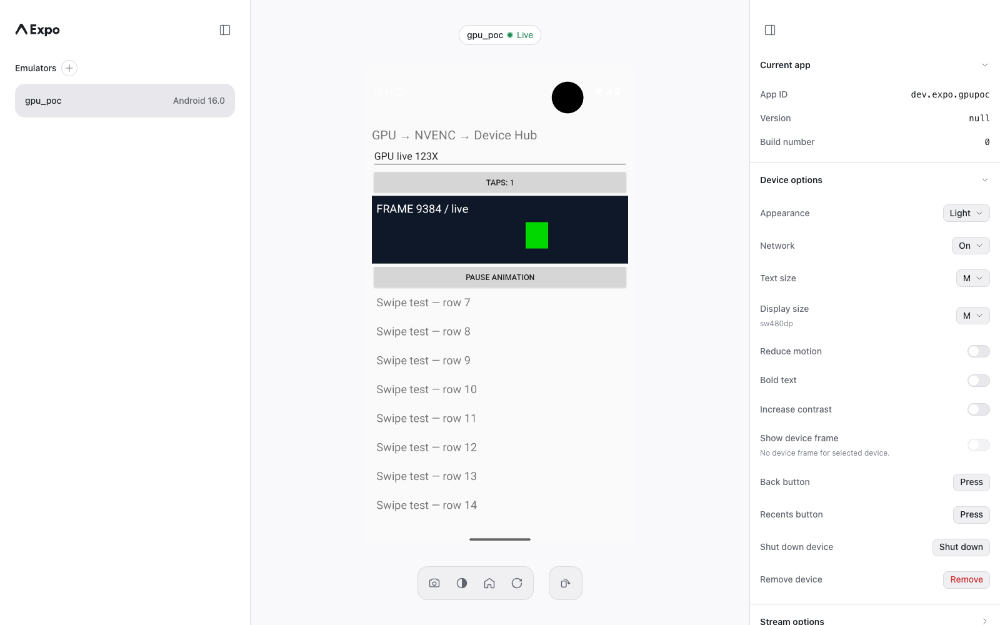

# Live Device Hub validation — 2026-09-11

**DO NOT MERGE — disposable Linux/NVIDIA experiment.**

The full loop ran on an NVIDIA L4 through an ngrok HTTPS endpoint:

```text
Emulator display GL texture → CUDA GPU copy → FFmpeg h264_nvenc
  → GPC1 Unix socket → experimental serve-emu adapter
  → existing Device Hub WebSocket → Chrome WebCodecs
Browser input → existing Hub routing → control-only scrcpy → Android
```

This run used 720×1280, 60 Hz, 12 Mbps target, emulator 36.6.11,
NVIDIA 580.178.04, private FFmpeg 8.0.1, Frida 17.18.0, and the published
`expo-device-hub@0.10.1` UI with this branch's vendored serve-emu build.
Chrome 150 on macOS decoded the stream. The worker ran Bun 1.3.14.

## Observed

- First video frame and changing animation through the public ngrok URL.
- Browser pointer tap incremented the guest counter; a pointer swipe moved the
  list from its first rows to rows 7–14.
- `/api/text` entered `GPU live 123`; a browser physical-key event appended `X`.
  The Hub Back button dismissed the Android keyboard.
- `/api/screenshot` returned HTTP 200 and a valid 67,430-byte PNG.
  This existing screenshot API intentionally reads pixels on the CPU, separately
  from the GPU video path.
- Browser refresh and a second tab both displayed the paused animation at frame
  6979. Restarting the Hub process also recovered that paused frame without
  restarting the emulator or reinjecting the module.
- During one 30-second idle interval, native captures increased from 13,310 to
  13,311 while encoded packets increased from 13,384 to 13,444: the retained CUDA
  frame supplied the idle packets. Occasional system UI updates still post frames.
- Resuming the animation restored approximately 60 source frames/s. The saved
  health sample reports 60 FPS, three video sockets, zero queued GPU packet
  bytes, no backpressure events, and no last error. It reports three client frame
  drops; the existing join gate discards delta frames until an IDR arrives.
- The final saved native sample reports **16,309 captures, 16,521 encoded packets,
  zero capture drops, zero capture errors, and zero capture-scope `glReadPixels`
  or `glGetTexImage` calls**. Encoded count includes idle repeats.
- The actual scrcpy process arguments include `video=false audio=false control=true`.
- `bun run --filter serve-emu check` passed: 993 tests, type checking, library/UI
  builds, coverage module checks, docs checks, and package smoke validation.
  The six new parser tests cover fragmentation, coalescing, immediate delivery,
  bounded/invalid input, partial EOF and SPS/PPS separation.

[Machine-readable evidence](summary.json), [live browser](browser.png),
[paused frame after Hub restart](idle-reconnect.png).



## Follow-up: 4K and WebRTC

The live emulator was subsequently restarted at **2160×3840, 120 Hz**, with
`POC_VSYNC=120 POC_TRANSPORT=webrtc` (`--video-fps 120 --transport webrtc
--max-dimension 0`). Android's active display mode reports 120 Hz and the browser
video element reports 2160×3840. WebRTC connected through direct ICE; ngrok carries
the UI and signaling.

The [WebRTC screenshot](4k-webrtc.png) shows **98 server FPS and 59 client FPS**,
zero reported packet loss, client dropped frames and freezes, and roughly 120 ms
RTT. The configured 120 FPS is a target: this live interactive workload did not
reproduce the standalone benchmark's sustained 120 FPS. The publisher's displayed
configured bitrate can differ from the injected encoder's fixed 12 Mbps setting.
No end-to-end latency or cause of the lower delivered rate was established.

The new capture expires by 13:52 UTC; the worker watchdog remains at 13:53 UTC.

## Limits

The 60 FPS figure is the server's source rate, not a measurement of browser
presentation rate or end-to-end latency. This run is distinct from the earlier
[4K/120 native capture benchmark](../README.md). The initial run did not test WebRTC; the follow-up above verifies connectivity
and records the lower delivered rates. We did not compare CPU utilization or
load-test slow receivers.
The native readback counters cover this capture path, not every possible driver
operation. Resolution/orientation and encoder settings remain fixed, and native
capture allocations live until emulator exit.

The dedicated staging workflow is `01a09053-99af-7b29-b729-06f494ea0783`, job
`01a09053-9b4a-7aed-8950-6a1195972529`. The capture was bounded to 90 minutes;
a watchdog ends this workflow's own keepalive by 13:53 UTC, within two hours of
its 11:56:33 UTC creation. The separate Device Hub workflow was not modified.
